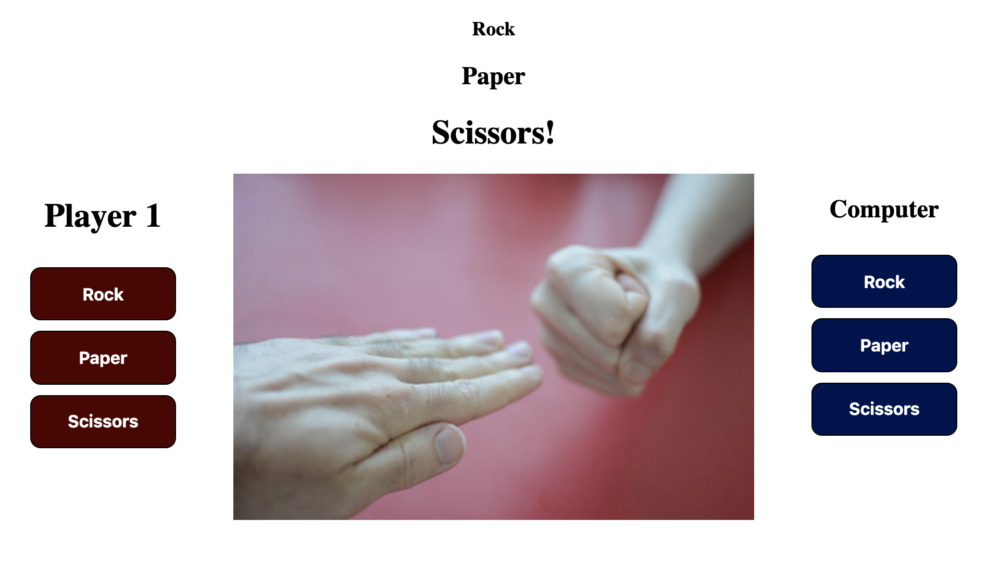
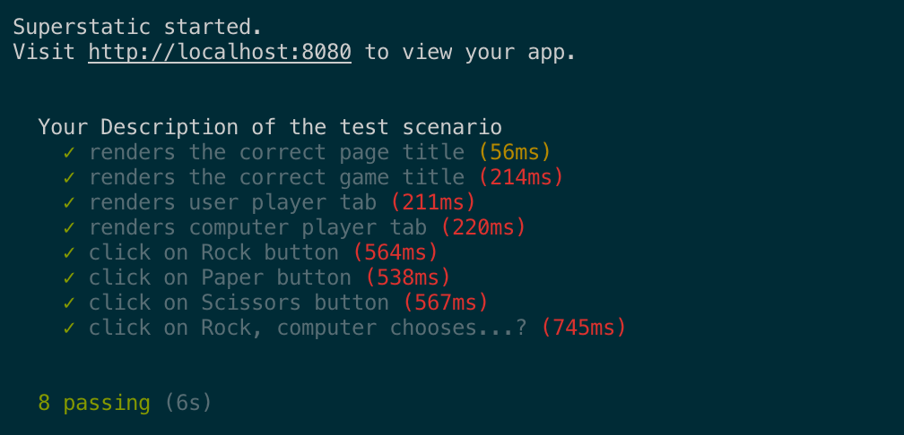
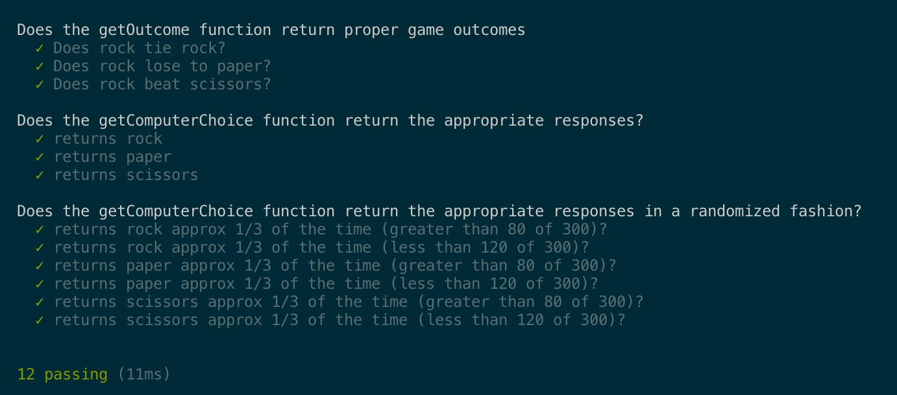

# Front End Application: Rock Paper Scissors (RPS) game
Developed and documented by,
* Aubain, Max - [Github](https://github.com/CA-ma)

## Summary
**Front end**: HTML; CSS; and JS.<br>
**Back end**: N/A.<br>
**Testing**: End-to-end (e2e) Training Wheels - unit and feature test.

This repository contains the code for one of my nights-and-weekends projects to develop a simple web game from scratch in JS, while testing the methods and features with a testing framework called [End To End Training Wheels](https://www.npmjs.com/package/e2e_training_wheels).  

If you have never played RPS, the game pits two players against each other in fight for domination that is played in rounds.  Each round...
* The players yell "Rock, Paper, Scissors, SHOOT!" slamming one of their fists into their other hand when they say each word.
* On "SHOOT!", they form their fist into a rock (clenched hand), a piece of paper (flat hand), or scissors (two fingers out and apart), to show their choice to their opponent.  
* The key here is that both players show their choices simultaneously so each can enjoy the suspense and surprise of having to intuit what the other player will decide upon, and try to counter. 
* The determination of the round winner is simple: rock breaks scissors, scissors cuts paper, and paper wraps rock.  If both players make the same choice, the result is a tie.

## Deployment
The [Rock Paper Scissors!](https://ca-ma-rps.netlify.com/) game is deployed from the [`development`](https://github.com/CA-ma/RPS_challenge_npm/tree/development) branch of this repository using Netlify services.  The game receives inputs from the user as 'Player 1' using the buttons on the left.  When a choice is selected, text messages display to show the computer response and the winner of the round, and the center image is swapped to reflect the choices of the player and the computer.



## Building, Development, and Testing
To locally run or test this application, fork this repository to your github account and clone to a local workspace.  The following instructions (for Mac OS terminal) will configure your local workspace with the necessary package manager and packages.  You can also refer to the e2e Training Wheels [installation guidelines](https://www.npmjs.com/package/e2e_training_wheels#installation).

```
// Initialize Node Package Manager (NPM)

$ npm init   

// Install e2e Training Wheels

$ npm i e2e_training_wheels --save-dev          
$ node ./node_modules/e2e_training_wheels/dist/install.js

// Run feature and unit tests sequentially from the test branch

$ git checkout test
$ npm test
```

Development is accomplished using Test Driven Development (TDD) and Behavior Driven Development (BDD) principles.  As such, tests are written before each coding sprint to set the scope of each feature as defined from a user's perspective.

Four user stories were drafted to define the Minimum Viable Product (MVP) of this application.

```
As a player of Rock Paper Scissors (RPS)...

In order to know what game I am playing,
I want to see a game title.

In order to play a round of RPS,
I want to play against the computer.

In order to play the game,
I want to choose rock, paper, or scissors each round.

In order to see the outcome of the round,
I want to have a visual cue of who is the winner.
```

In accordance with the first three user stories, the UI is developed first with buttons implemented to recieve the user choice as a button click to generate `playerChoice`.  Next, the final user story is fulfilled by generating the game logic contained in [`/src/js/app.js`](/src/js/app.js) comprising three primary functions that are defined by their complementary unit tests contained in [`/spec/unit.spec.js`](/spec/unit.spec.js).  The function/test pairs are as follows,

1. `getOutcome` receives arguments `playerChoice` and `computerChoice`, compares them according to the game logic mechanistically described above, and returns the game round outcome.
2. `getComputerChoice` is a compound method that receives `playerChoice` as an input, generates the `computerChoice` as 'rock', 'paper', or 'scissors', and calls `getOutcome` to compare `playerChoice` to `computerChoice`.
3. `getComputerChoice` is refactored to generate `computerChoice` with a random variable instead of a fixed value.

Upon running `$ npm test` in the [`test`](https://github.com/CA-ma/RPS_challenge_npm/tree/test) branch, the passing of these unit tests, and feature test contained in [`/features/application.feature.js`](/features/application.feature.js) with all four user stories, is confirmed.

**Feature Test Results**<br>


**Unit Test Results**<br>


The last set of unit tests are effective, while perhaps non-standard, at testing for a random outcome.  For example, 'returns rock approx 1/3 of the time` is checking for the computerChoice 'rock' in 300 trials.  Given 300 trials and a random outcome that has a probability of happening 1/3 of the time, the mean should then =100.  We cannot test the mean without undue computational resources, and so the tests pass if the number of times 'rock' is randomly chosen is above 80 and below 120 for any single test.  Occationally, this test will fail during a statistical outlier event, for example, when 'rock' is chosen by the computer 76 times out of 300, but this does not mean that the code is working improperly.

**Note on repository commit history**<br>
The [`02_migrate_files_from_past_project`](https://github.com/CA-ma/RPS_challenge_npm/tree/02_migrate_files_from_past_project) branch includes files that were scripted originally by the author for this project but drafted in another repository.  As such, they were copied from their original repository into the current one.  If you would like to see the original commit commit history for these files in their original repository, it is found [here](https://github.com/CA-ma/RPS_challenge/commits/05_see_outcome).

## Acknowledgements
Thank you to [Craft Academy](https://craftacademy.se/) in Stockholm, Sweden for crafting this challenge.
